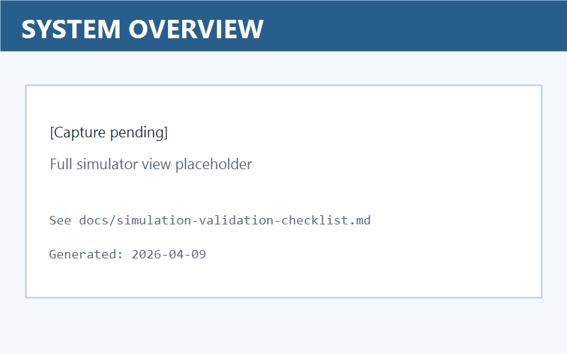
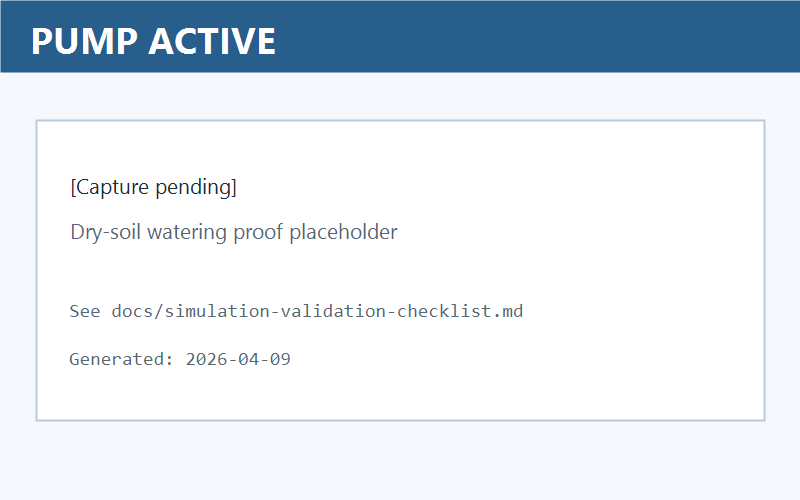
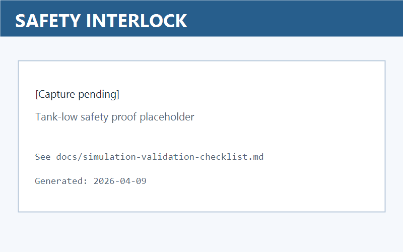
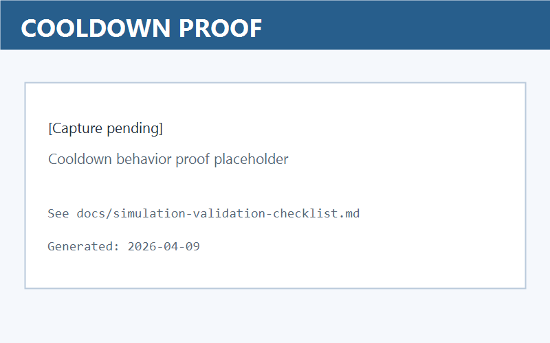

# ESP32 Smart Plant Irrigation

An ESP32 irrigation controller with two tracks: modular firmware for real hardware and a local Wokwi digital twin for repeatable validation and demos.

## Project Overview

The controller reads soil moisture, temperature/humidity (DHT22), and tank level, then decides whether watering is allowed. It includes three practical safety controls:
- tank interlock (no dry-run)
- cooldown delay (anti-chatter)
- watchdog timeout (hard pump cutoff)

## Architecture

| Layer | Files |
|---|---|
| Firmware (modular) | `main.ino`, `include/config.h`, `include/sensors.h`, `include/irrigation.h`, `include/telemetry.h` |
| Digital twin (Wokwi) | `simulation/wokwi/sketch.ino`, `simulation/wokwi/diagram.json`, `simulation/wokwi/wokwi.toml`, `simulation/wokwi/scripts/` |
| Validation assets | `docs/simulation-validation-checklist.md`, `docs/images/` |
| Hardware notes | `hardware/components_list.txt`, `hardware/assembly_notes.txt` |

## Local Digital Twin Workflow

1. Install dependencies once:
   - `arduino-cli core update-index`
   - `arduino-cli core install esp32:esp32`
   - `arduino-cli lib install "DHT sensor library for ESPx"`
2. Run **`Wokwi: Build Firmware`** from VS Code tasks.
3. Start **`Wokwi: Start Simulator`**.
4. Verify generated outputs:
   - `simulation/wokwi/build/sketch.ino.bin`
   - `simulation/wokwi/build/sketch.ino.elf`

## Validation Evidence

Validation scenarios and capture steps are documented in `docs/simulation-validation-checklist.md`.

## Hardware Roadmap

Current state: digital twin validated firmware logic.

Planned path:
1. **Digital twin** (done): decision logic and safety behavior
2. **Physical prototype** (next): bench wiring, pump/tank tests, enclosure
3. **Cloud telemetry** (future): remote dashboard and long-run trend logging

### Prototype Image Placeholders

- Stage 1 bench prototype: `docs/images/prototype-stage1-placeholder.png`
- Stage 2 assembled prototype: `docs/images/prototype-stage2-placeholder.png`

Replace these files with real photos when hardware milestones are complete.

## Configuration

Main tuning values are in `include/config.h`:
- `SOIL_DRY_THRESHOLD_PERCENT`
- `PUMP_ON_DURATION_MS`
- `PUMP_COOLDOWN_MS`
- `PUMP_WATCHDOG_MS`

## Outcomes

- Clean modular firmware structure for embedded interviews and reviews
- Local simulation workflow that can be rerun on any machine with VS Code + Wokwi + Arduino CLI
- Clear validation trail for pump activation, interlock behavior, and cooldown logic

Project by Niroop Baliji.
