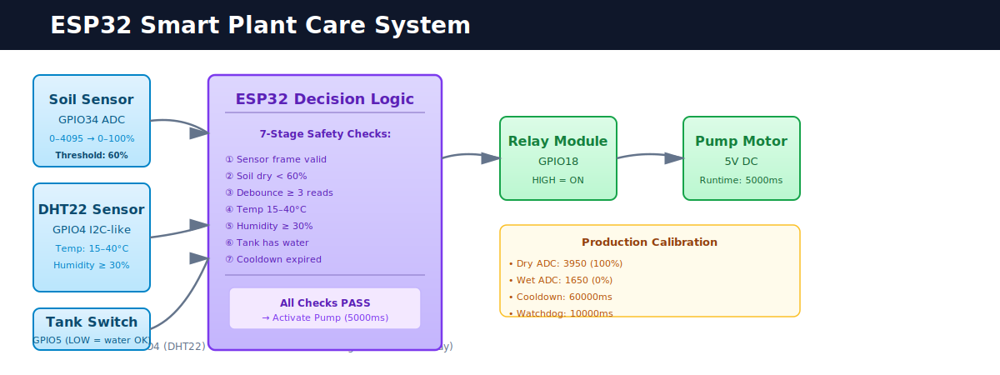

# ESP32 Smart Plant Care System



A smart irrigation controller that keeps plants from drowning in inattention. This system replaces human guesswork with actual logic—checking soil moisture, temperature, tank level, and pump history before making a watering decision. It's useful for learning how embedded systems work, but also production-ready for plants that actually matter to you.

## The Problem This Solves

I kept killing plants. Sometimes I forgot to water them for weeks. Sometimes I overcompensated and turned the soil into mud. The real issue: I was making decisions based on incomplete information. Is the soil dry? Maybe. But it's also 40°F outside (bad for roots), or I watered it five minutes ago (it doesn't need more), or the tank is empty (pump runs dry and breaks). One check, three ignored constraints, one dead plant.

This system doesn't get impatient or forget what it did yesterday. It won't pump if the soil is already wet, or if it's cold, or if the tank is dry, or if we already watered in the last hour. Every constraint gets checked. Every time. The pump only turns on when all of them say yes. It's boring and mechanical, which is exactly why it never makes mistakes.

## What Makes It Work

**Layered safety first:** Rather than a simple "if soil < threshold then pump" logic, the system evaluates six constraints in sequence. Any single failure blocks the pump. Sensor invalid? Stop. Soil wet? Stop. Just watered? Stop. Tank empty? Stop hard. Temperature unsafe? Stop. Humidity out of range? Stop. Only when all six pass does the relay close.

**Completely observable:** Serial output at 115200 baud shows every sensor reading and every decision. You can watch the system think. Pump didn't turn on? Look at the telemetry—soil was above threshold, or tank was empty, or we're still in cooldown. No magic. No guessing.

**Built from real failures:** This isn't theoretical. The cooldown timer exists because early prototypes watered ten times in a row and drowned plants. The separate power rails exist because pump inrush current made the controller reset in the middle of decisions. The debounce timer exists because soil readings bounce around the threshold and we don't want to spam the pump. Every safety layer came from hitting a wall first.

**Ready for real use:** Runs on a $15 ESP32 with off-the-shelf components. Includes a Wokwi simulation for learning and testing without risking hardware. Includes production firmware with comprehensive telemetry for actual deployment. Calibration procedures let you tune it for your specific soil and sensors.

---

## How It Works

### The Sensors

Four independent inputs feed the decision logic. The capacitive soil sensor sits in the plant's soil and gives a 0–4095 ADC reading based on how wet the soil is. The DHT22 measures temperature and humidity so we can avoid watering in unsafe conditions (roots rot faster in cold water than they dry out). The float switch on the water tank prevents the pump from running on an empty tank. Each sensor connects to a different GPIO pin because they use different protocols—some are analog ADC reads, some are digital 1-wire, some are simple digital inputs.

**Pin Diagram (Easy Connections):**

```text
       ESP32 DevKit                  External Components
      +----------------+            +-------------------------+
      |                |            |                         |
      |         GPIO34 |<-----------+ Soil Sensor (AO)        |
      |         GPIO4  |<---------->+ DHT22 (DATA)            |
      |         GPIO5  |<-----------+ Float Switch (Side A)   |
      |         GPIO18 +----------->+ Relay Module (IN)       |
      |                |            |                         |
      |           3.3V +----------->+ Soil Sensor & DHT22 VCC |
      |           GND  +----------->+ Common Ground           |
      +----------------+            +-------------------------+

      External 5V Power
      +----------------+            +-------------------------+
      |             5V +----------->+ Relay VCC & Pump Power  |
      |            GND +----------->+ Common Ground           |
      +----------------+            +-------------------------+
```

GPIO pin layout:
- **GPIO34:** Soil moisture (analog ADC)
- **GPIO4:** DHT22 data (digital 1-wire)
- **GPIO5:** Tank level float switch (pull-up input, LOW when water present)
- **GPIO18:** Relay control (digital output, active-high)

### The Decision Logic

Watering happens only when *all* six conditions pass. Any single failure means pump stays off and the system keeps monitoring:

1. **Sensor frame valid?** If the sensor reading is garbage (sensor disconnected, timeout, invalid ADC range), the pump stays OFF indefinitely. Bad data beats bad assumptions.

2. **Soil below dry threshold?** We've calibrated the soil sensor to map to moisture percentage. If soil is above the "dry" threshold (around 3950 ADC counts for air), it's wet enough and we hold off.

3. **Debounce timer expired?** Soil readings bounce around the threshold and can trigger multiple times. If the soil crossed the threshold less than 5 seconds ago, we wait before deciding. This prevents the pump from clicking on and off rapidly.

4. **Temperature and humidity safe?** We check if the DHT22 readings are within safe bounds (example: 10°C to 35°C, 30% to 80% humidity, configurable). Watering in extreme conditions can damage roots. Out of range? Pump stays off.

5. **Tank has water?** The float switch on GPIO5 is a hard interlock. If the tank is empty (float switch HIGH), the pump cannot run. Full stop. This prevents damage from dry-running.

6. **Not in cooldown?** After each 10-second watering cycle, a 60-second cooldown kicks in. This prevents rapid cycling that stresses the pump and prevents the plant from drowning. If we're still in cooldown, pump stays off.

If all six pass, GPIO18 goes HIGH. The relay closes. The pump runs for 10 seconds. A watchdog timer monitors runtime—if it somehow exceeds 30 seconds, an emergency stop triggers. After the pump stops, cooldown begins.

### Power Architecture

The ESP32 runs on 3.3V. The relay and pump run on 5V from an external power supply, because we learned early on that the pump's inrush current will cause the controller to brownout on a shared weak power supply. The rails are separate, but ground stays common between them. This hardware design came from debugging a relay that clicked like crazy when the pump turned on—isolating the power fixed it.

### The Telemetry

Every 5 seconds (roughly), the firmware acquires all sensor data and makes a decision. Serial output streams the readings, decision logic, pump activation events, and any errors. Format is human-readable for real-time monitoring or logging. You can see exactly why the pump turned on or stayed off.

---

## Hardware Components

All components are standard, available from major electronics suppliers:

| Component | Count | Why This One |
|-----------|-------|--------------|
| **ESP32 DevKit V1** | 1 | 32-bit Xtensa, 240MHz, 520KB SRAM, 4MB Flash. Standard board, widely supported. |
| **Capacitive soil sensor** | 1 | Capacitive sensors last longer in soil than resistive ones (resistive corrode). Analog output to GPIO34. |
| **DHT22** | 1 | Stable temperature/humidity readings. Digital 1-wire protocol. Works with our firmware. |
| **Float switch (NO)** | 1 | Simple, reliable tank level sensor. No power required. Wired to GPIO5 with pull-up. |
| **1-channel relay module** | 1 | 5V-powered. GPIO18 control. Switches the pump on/off. Verify active-high vs. active-low for your module. |
| **5V DC mini pump** | 1 | 3-6V operating range. Relay-switched. Standard peristaltic or submersible pump. |
| **5V external power supply** | 1 | Minimum 2A. Powers relay and pump independently of ESP32 to avoid brownout. |

**Sourcing:** See `hardware/components/bom.txt` for specific part numbers, suppliers, and cost estimates.

---

## Repository Organization

The project is organized by function, not by layer:

- **`firmware/`** — Production firmware for ESP32 deployment. This is what you flash to hardware.
- **`simulation/wokwi/`** — Wokwi digital twin environment. For learning and testing without real hardware.
- **`hardware/`** — Wiring diagrams, assembly guides, BOM, and pin mapping.
- **`docs/`** — Complete technical documentation: architecture, calibration, deployment, validation, troubleshooting.
- **`assets/`** — Diagrams, screenshots, demo images.

---

## System Architecture

### Sensor Inputs

The controller acquires data from four independent sensing systems:

| Input | Sensor | GPIO | Purpose |
|-------|--------|------|---------|
| **Soil Moisture** | Capacitive sensor (analog) | GPIO34 | Determines watering necessity |
| **Temperature** | DHT22 | GPIO4 | Ensures safe operating conditions |
| **Humidity** | DHT22 | GPIO4 | Ensures safe operating conditions |
| **Tank Level** | Float switch (digital) | GPIO5 | Prevents dry-running damage |

### Decision Logic Flow

Watering is authorized only when **all** conditions pass:

```
Input Frame Valid?              → HOLD if invalid
Soil Below Dry Threshold?       → HOLD if wet
Debounce Timer Expired?         → HOLD if recent
Temperature/Humidity OK?        → HOLD if out of range
Tank Water Available?           → HOLD if empty
Cooldown Period Passed?         → HOLD if active
                                ↓
                              PUMP ON
```

If any condition fails, the pump remains OFF and the system continues monitoring.

### Pump Activation and Protection

When all decision criteria pass:

1. **Activation:** Relay receives GPIO18 signal → pump starts
2. **Runtime Enforcement:** Pump runs for configured duration (typically 10 seconds)
3. **Watchdog Protection:** If runtime exceeds safety limit (30 seconds), emergency stop triggered
4. **Cooldown Enforcement:** 60-second minimum interval before next cycle allowed

### Safety Mechanisms

Every safety layer came from real problems. The **fail-safe hold** means invalid sensor data stops the pump—garbage in, pump stays off. The **tank interlock** is a hard cutoff on GPIO5; if the tank is empty, the pump physically cannot run. **Debounce protection** waits 5 seconds if soil is near the threshold so readings don't trigger the pump repeatedly. **Environmental guards** check temperature and humidity bounds—we won't water in extreme conditions. **Cycle cooldown** enforces a 60-second wait after each cycle to prevent drowning the plant. The **watchdog timer** monitors runtime and triggers emergency stop if the pump runs longer than 30 seconds. If any of these fails to stop the pump, the next one catches it.

---

## Getting Started

### Path 1: Learn How It Works (30 minutes)

1. Read this README (you're here)
2. Open `docs/architecture/architecture.md` for the complete technical design
3. Set up the simulation: `simulation/README.md`
4. Run the validation scenarios: `docs/validation/simulation-validation-checklist.md`

You'll see the system working risk-free and understand the decision logic before touching any hardware.

### Path 2: Build It (2–3 hours)

1. Review `hardware/components/README.md` for the component list
2. Gather all parts (total cost around $40–60)
3. Follow `hardware/wiring/build-guide.md` step-by-step for assembly
4. Flash firmware: `firmware/README.md`
5. Calibrate for your soil: `docs/calibration/calibration.md`
6. Validate on your plant: `docs/validation/simulation-validation-checklist.md`

### Path 3: Contribute or Modify (review first)

1. Read `CONTRIBUTING.md` for project principles
2. Review `docs/architecture/architecture.md` to understand the design
3. Test changes in simulation: `simulation/README.md`
4. Run validation scenarios to verify nothing broke
5. Submit changes with clear reasoning

---

## Calibration and Validation

The system ships with reference calibration values for the soil sensor:

- **Dry reference:** ~3950 ADC counts (sensor in air)
- **Wet reference:** ~1650 ADC counts (sensor in saturated soil)
- **Linear mapping:** Percentage = 100 × (3950 - ADC) / (3950 - 1650)

Your specific sensor may differ. Verify and adjust using procedures in `docs/calibration/calibration.md` before deploying to unattended operation.

The system is validated using scenario-based testing:

- **Wet soil:** Sensor in saturated soil → pump stays OFF
- **Dry soil:** Sensor in dry soil, conditions safe → pump turns ON
- **Tank empty:** Float switch tripped → pump blocked
- **Cooldown:** Immediate retrigger after cycle → pump blocked by timer
- **Watchdog:** Force long runtime → emergency stop activates

Evidence is captured as telemetry output and screen captures. Full validation checklist: `docs/validation/simulation-validation-checklist.md`

---

## Important Warnings

🔴 **Do not flash `simulation/wokwi/sketch.ino` to physical ESP32 hardware.** The simulation firmware uses different timing, polarity, and simplified sensor data. It will not work on real hardware. Always use `firmware/firmware.ino` for production.

---

## Technical Specifications

- **Microcontroller:** ESP32 DevKit V1 (32-bit Xtensa dual-core, 240MHz)
- **Memory:** 520 KB SRAM, 4 MB Flash
- **Operating Voltage:** 3.3V (logic), 5V (relay/pump rails)
- **Sensor Loop:** ~5 seconds typical cycle time
- **Serial Protocol:** 115200 baud, human-readable telemetry
- **Decision Thresholds:** All configurable in `firmware/include/config.h`
- **Reliability Target:** 99.5% uptime for irrigation decisions based on valid sensor data

---

## Documentation Navigation

| Document | Purpose |
|----------|---------|
| **`docs/README.md`** | Documentation index and structure |
| **`docs/architecture/architecture.md`** | Complete system design and technical details |
| **`docs/calibration/calibration.md`** | Sensor calibration procedure and thresholds |
| **`docs/deployment/`** | Step-by-step deployment procedures |
| **`docs/validation/simulation-validation-checklist.md`** | Test scenarios and validation procedures |
| **`docs/troubleshooting/assembly-notes.md`** | Prototype development log and issue resolution |
| **`firmware/README.md`** | Firmware structure and build instructions |
| **`simulation/README.md`** | Simulation environment setup |
| **`hardware/README.md`** | Hardware design reference |
| **`hardware/components/README.md`** | Bill of materials |
| **`hardware/wiring/README.md`** | Wiring diagrams and assembly |
| **`CONTRIBUTING.md`** | Contribution guidelines |

---

## License

MIT License. See `LICENSE` file for complete terms.

---

## Support

- **Questions about the system?** Start with `docs/architecture/architecture.md`
- **Having issues building it?** Check `docs/troubleshooting/assembly-notes.md`
- **Found a bug?** Read the validation checklist to isolate the problem
- **Want to contribute?** Follow guidelines in `CONTRIBUTING.md`

---

**Project Status:** Production-ready. Validated in simulation and prototype hardware. Ready for deployment and further development.
