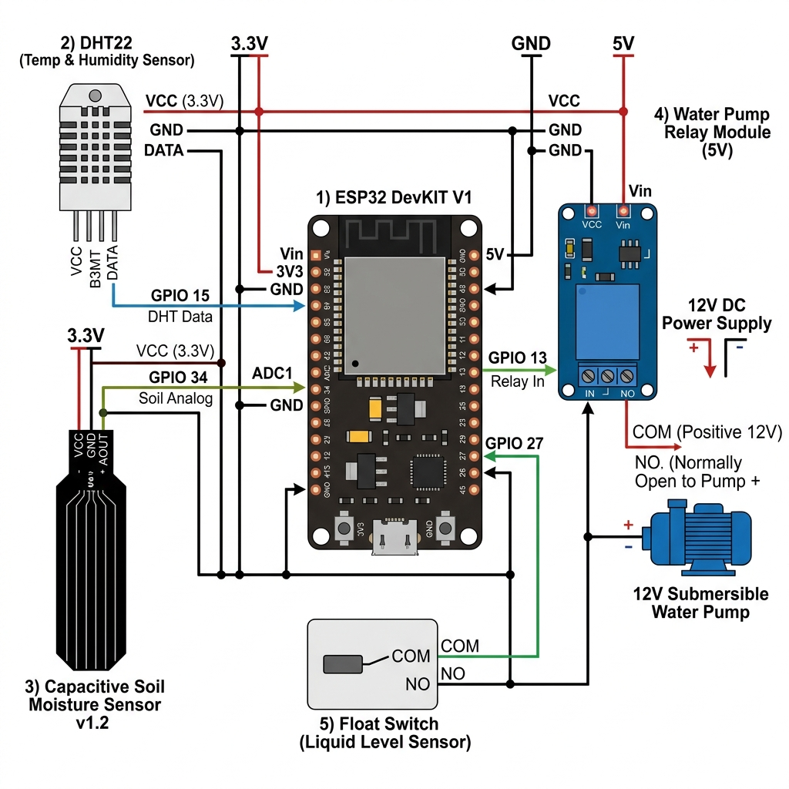

# ESP32 Smart Plant Care System




A small ESP32‑based irrigation controller that keeps plants healthy by watering only when the conditions are right. It monitors soil moisture, temperature, humidity, and tank level, then decides whether to turn on the pump. The design is simple enough for hobbyists, yet robust enough for daily use.

## Why This Project Exists

Plants are easy to forget. Too much water drowns them; too little leaves them thirsty. This firmware replaces guesswork with reliable logic:
- **Safety first:** Every sensor must agree before the pump runs.
- **Transparency:** All decisions are printed to the serial monitor.
- **Learn by doing:** A Wokwi simulation lets you experiment without hardware.

## Quick Start Guide

1. **Clone the repo**
   ```bash
   git clone https://github.com/yourusername/ESP32-PLANT-CARE.git
   ```
2. **Upload the firmware**
   - Open `firmware/` in PlatformIO or the Arduino IDE.
   - Build and upload to your ESP32.
3. **Wire the hardware**
   - Follow the wiring diagram in `hardware/wiring/wiring-diagram.png`.
4. **Open the serial monitor**
   - Set the baud rate to **115200**.
   - Answer the 10‑second calibration prompt.
5. **Watch it work**
   - The system prints sensor readings and explains why the pump turns on or stays off.

---

## How It Works

### Sensors
- **Soil sensor** (GPIO34) gives an ADC reading (0‑4095).
- **DHT22** (GPIO4) supplies temperature and humidity.
- **Float switch** (GPIO5) tells us if the water tank is empty.

### Decision Logic
The controller evaluates seven conditions. If any one fails, the pump stays off:
1. Sensor data is valid.
2. Soil is dry enough.
3. A short‑term debounce timer has expired.
4. Temperature is within a safe range.
5. Humidity is within a safe range.
6. The tank contains water.
7. The cooldown period after a previous watering has passed.

When all conditions pass, the pump (GPIO18) is powered for a preset duration, then a cooldown timer starts.

---

## Project Structure

- `firmware/` – Production firmware for the ESP32.
- `simulation/` – Wokwi digital‑twin for safe experimentation.
- `hardware/` – Wiring diagrams, bill of materials, and assembly guides.
- `docs/` – Detailed technical documentation.
- `assets/` – Images and diagrams used throughout the repo.

---

## Getting Started

### Path 1 – Learn (≈30 min)
1. Read this README.
2. Browse `docs/01_architecture.md` for the system design.
3. Run the Wokwi simulation (`simulation/README.md`).
4. Try the validation scenarios in `docs/06_validation.md`.

### Path 2 – Build (2‑3 h)
1. Review the component list in `hardware/components/README.md`.
2. Gather parts (≈ $40‑$60 total).
3. Follow the step‑by‑step wiring guide in `hardware/wiring/build-guide.md`.
4. Flash the firmware (`firmware/README.md`).
5. Calibrate the sensor using `docs/04_calibration.md`.
6. Validate the system on a real plant (`docs/06_validation.md`).

### Path 3 – Contribute
1. Read `CONTRIBUTING.md` for the project’s philosophy.
2. Study the architecture (`docs/01_architecture.md`).
3. Test changes in the simulation.
4. Run the validation suite before opening a pull request.

---

## Calibration & Validation

The firmware ships with reference values:
- **Dry reference:** ~3950 ADC counts (sensor in air).
- **Wet reference:** ~1650 ADC counts (sensor in saturated soil).
- **Mapping:** `percentage = 100 × (3950 - ADC) / (3950 - 1650)`.

Adjust these numbers in `docs/04_calibration.md` if your sensor behaves differently.

### Validation Checklist
- **Wet soil:** Pump stays off.
- **Dry soil:** Pump turns on when other safety checks pass.
- **Empty tank:** Pump remains off regardless of soil moisture.
- **Cooldown:** Pump does not restart immediately after a cycle.
- **Watchdog:** Pump stops automatically if it runs too long.

All checks are documented in `docs/06_validation.md`.

---

## Important Warnings

🚨 **Never flash the Wokwi simulation sketch (`simulation/wokwi/sketch.ino`) to real hardware.** The simulation uses different timing and polarity and will damage the device. Always use `firmware/firmware.ino` for the actual ESP32.

---

## Technical Specs

- **Microcontroller:** ESP32 DevKit V1 (240 MHz, 520 KB SRAM, 4 MB Flash).
- **Power:** 3.3 V logic, separate 5 V rail for the pump and relay.
- **Sensor loop:** Approximately every 5 seconds.
- **Serial output:** 115200 baud, human‑readable.
- **Decision thresholds:** Configurable in `firmware/include/config.h`.
- **Reliability target:** 99.5 % uptime for irrigation decisions.

---

## Navigation

| Document | Purpose |
|----------|---------|
| `docs/README.md` | Overview of all documentation |
| `docs/01_architecture.md` | System design details |
| `docs/04_calibration.md` | Calibration procedures |
| `docs/05_deployment.md` | Step‑by‑step deployment |
| `docs/06_validation.md` | Test scenarios |
| `docs/07_troubleshooting.md` | Known issues and fixes |
| `firmware/README.md` | Firmware build instructions |
| `simulation/README.md` | Simulation setup |
| `hardware/README.md` | Hardware design reference |
| `CONTRIBUTING.md` | How to contribute |

---

## License

MIT – see the `LICENSE` file for details.

---

## Support

- **General questions?** Start with `docs/01_architecture.md`.
- **Build problems?** Check `docs/07_troubleshooting.md`.
- **Found a bug?** Run the validation checklist and open an issue.
- **Want to help?** Follow the contribution guide in `CONTRIBUTING.md`.

---

**Project Status:** Production‑ready, validated in both simulation and hardware. Feel free to clone, build, and improve!
